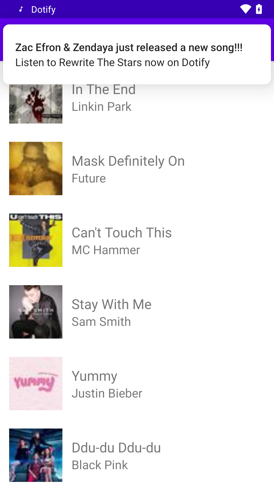

# Dotify by David Xie (Assignment 4)

## Description

This app shows a music player interface, with album art, song title, artist, and album names. Additionally, there're previous, play, and next playback control button available.

## Attempted extra credit

1. FOR DOTIFY project ONLY: In requirement 2.b.v.2, tapping the notification should launch PlayerActivity that passes the song data to the activity to show the song in the player (+1)
2. In a separate function, create another separate alternative work request that runs every 2 days when the device’s battery is not too low and is connected to a network. For credit, you just need the request code in your WorkManager class, no other code is required. (+.25)

## Screenshot

