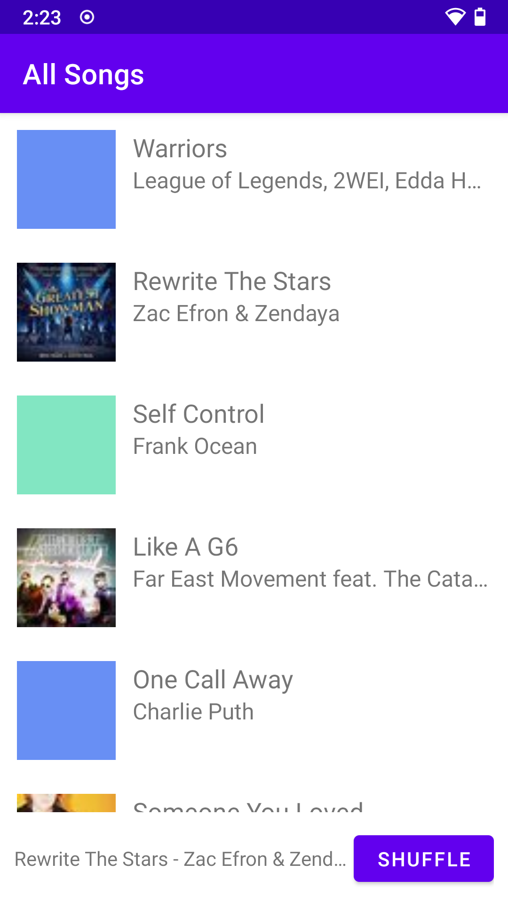
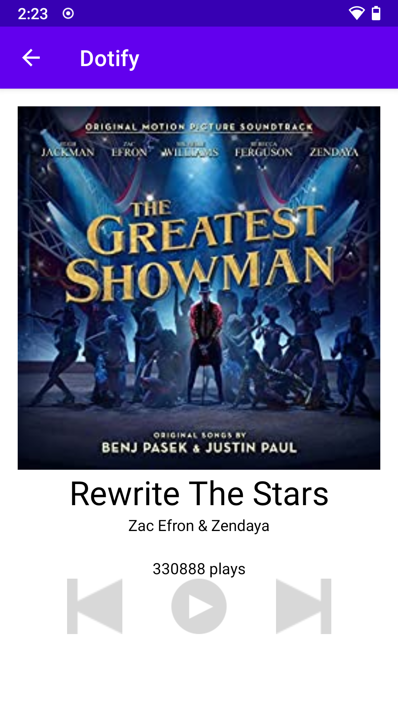

# Dotify by David Xie

## Description

This app shows a music player interface, with album art, song title, artist, and album names. Additionally, there're previous, play, and next playback control button available.

## Documentation

[Song Data Provider API](https://github.com/echeeUW/SongDataProvider)

## Attempted extra credit

1. Show a stock Android back arrow button, ←, in the Header/Toolbar of Activity B. When clicked, it should navigate back to SongListActivity (+.25)

2. (+.25) Long pressing on an item should delete that song on the list.
    
    It should show a Toast that says what song was deleted.
    
3. When a user presses shuffle, the list should animate the changes using DiffUtil (+1)

## Screenshot

