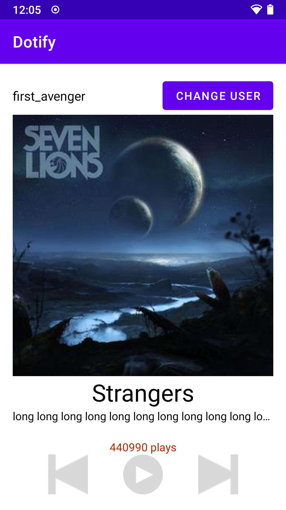

# Dotify by David Xie

## Description

This app shows a music player interface, with album art, song title, artist, and album names. Additionally, there're previous, play, and next playback control button available.

## Screenshot

## Attempted extra credit

1. A user is not allowed to apply a new username if the edit text field is empty. (+ 0.25)
2. Long pressing on the cover image changes the text color of the play count to a different color. (+ 0.25) 
3. If using ConstraintLayout, utilize a Barrier or Guideline somewhere with a view constrained to it (+0.25) 
4. All hardcoded dimensions & colors are extracted into res/values/dimens.xml & res/values/colors.xml respectively (+ .5)