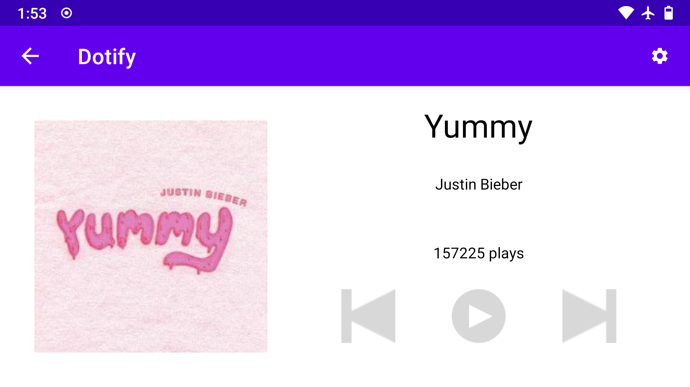
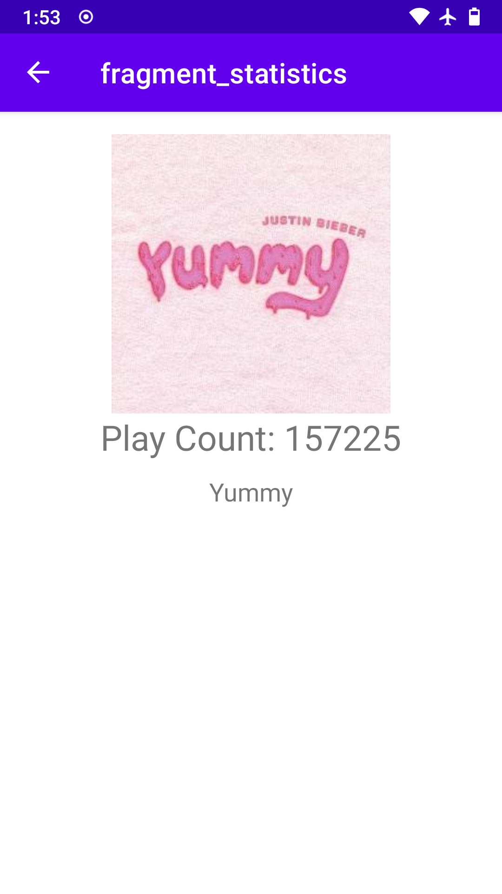

# Dotify by David Xie (Assignment 3)

## Description

This app shows a music player interface, with album art, song title, artist, and album names. Additionally, there're previous, play, and next playback control button available.

## Documentation

[Song Data Provider API](https://github.com/echeeUW/SongDataProvider)

## Attempted extra credit

1. Every Fragment (other than SettingsFragment) has a Up/back button in the top right corner. Clicking will take you back to the previous fragment (+.25)

2. (TODO) Instead of Settings <Button> in your layout from requirement #1, make a Settings "Action Button” in the app bar (header bar at the top). https://developer.android.com/training/appbar/actions (+.25)

## Screenshot

